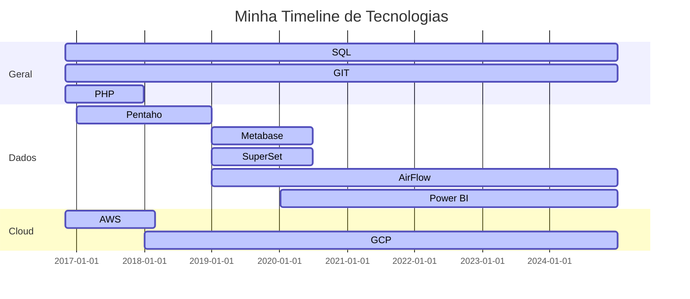

## Olá, meu nome é Artur Alves!

- 🔭 Atuo atualmente como Engenheiro de Dados com foco em soluções da GCP.
- 🌱 Formado em Sistemas de Informação pela FIAP.

```mermaid
gantt
dateFormat  YYYY-MM-DD
title Minha Timeline de Tecnologias
section Geral
SQL           :active,, 2016-11-01,2024-12-31
GIT           :active,, 2016-11-01,2024-12-31
PHP           :active,, 2016-11-01,2017-12-31

section Dados
Pentaho       :active,, 2017-01-01,2018-12-31
Metabase      :active,, 2019-01-01,2020-06-30
SuperSet      :active,, 2019-01-01,2020-06-30
AirFlow       :active,, 2019-01-01,2024-12-31
Power BI      :active,, 2020-01-07,2024-12-31

section Cloud
AWS           :active,, 2016-11-01,2018-02-28
GCP           :active,, 2018-01-01,2024-12-31
```

## Contatos:

   

